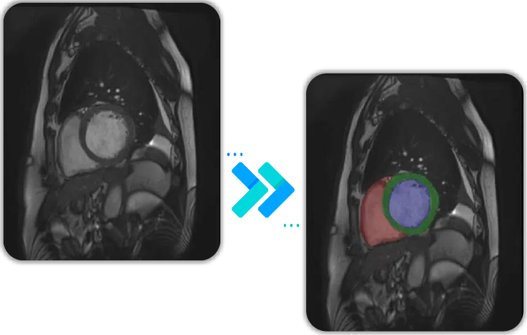
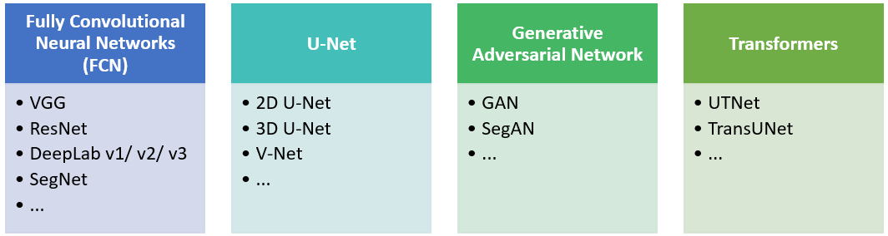

  

<h1 align="center">Medica Image Segmentation</h1>

## 1. Problem Statement
Image segmentation is a vital aspect of image processing, differentiating itself from image classification by providing pixel-level identification of image content. It involves dividing an image into distinct regions based on features like color, texture, and shape, enabling internal consistency within regions and clear distinctions between them.
 
medical image segmentation is a critical prerequisite for healthcare systems, aiding in disease diagnosis and treatment planning. It analyze and process 2D or 3D images to achieve segmentation, extraction, three-dimensional reconstruction and three-dimensional display of human organs, soft tissues and diseased bodies. 
With the rapid development of deep learning, image segmentation methods, have achieved good results and it encompasses various applications, from the brain and eyes to the chest, abdomen, and heart [1].

## 2. Related Works
The medical image segmentation network uses an encoder-decoder structure. The encoder extracts features from the input image and turns them into a low-resolution map. The decoder then takes this map and labels each pixel in high detail to realize the category labeling of each pixel.
The first successful deep learning network for image segmentation was the fully convolutional network. It paved the way for using convolutional neural networks in this task. Then there are Other networks like U-Net, Mask R-CNN, RefineNet, and DeconvNet, which have a strong advantage in processing fine edges.
U-Net, which uses a U-shaped architecture with skip-connections, has become a standard for medical image segmentation, achieving great success. Transformers are also being used, as seen in papers like UTNet and TransUNet. They combine Transformers and Convolutional Neural Networks for better results  and use benefits of both networks.
We could classifies deep learning-based medical image segmentation into four categories: FCN, U-Net, GAN, and Transformers. See the figure below for these categories with examples for each.

## 3. The Proposed Method

## 4. Implementation
 
Medical image segmentation involves several key steps:

1. Obtain a dataset and divide it into training, testing, and validation sets.

2. Preprocess the images, which typically includes standardizing the input images and augmenting the dataset by applying random rotations and scalings to increase its size.

3. Apply a suitable medical image segmentation method.

4. To assess the quality of the segmentation, establish relevant performance metrics and validate the results accordingly.

### 4.1. Dataset
Under this subsection, you'll find information about the dataset used for the medical image segmentation task. It includes details about the dataset source, size, composition, preprocessing, and loading applied to it.
[Dataset](https://drive.google.com/file/d/1-2ggesSU3agSBKpH-9siKyyCYfbo3Ixm/view?usp=sharing)

### 4.2. Model

### 4.3. Configurations

### 4.4. Train

### 4.5. Evaluate

## 5. Refrences
[1]: Liu, X., Song, L., Liu, S., & Zhang, Y. (2021). A review of deep-learning-based medical image segmentation methods. Sustainability, 13(3), 1224.

