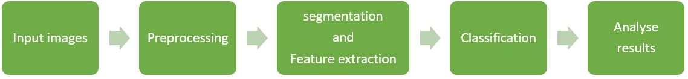

  

<h1 align="center">Medica Image Segmentation</h1>

## 1. Problem Statement
### Image Segmentation
Image segmentation is a vital aspect of image processing, differentiating itself from image classification by providing pixel-level identification of image content. It involves dividing an image into distinct regions based on features like color, texture, and shape, enabling internal consistency within regions and clear distinctions between them [1].
 
Image segmentation is a more fine-grained task that involves assigning a label to each pixel in an image to delineate different objects or regions.   
in segmentation, we are trying to draw  a careful outline around the object that is  detected so that you know exactly which  pixels belong to the object and which pixels don't. 
The output of a segmentation model is a pixel-wise mask that represents the segmentation boundaries.   
Image segmentation is commonly used when you need to precisely segment and identify individual objects or regions within an image. It’s particularly valuable in medical imaging, autonomous driving, and other scenarios where precise spatial understanding is crucial.
 
### medical image segmentation

medical image segmentation is a critical prerequisite for healthcare systems, aiding in disease diagnosis and treatment planning. It analyzes and processes 2D or 3D images to achieve segmentation, extraction, three-dimensional reconstruction, and three-dimensional display of human organs, soft tissues, and diseased bodies. 
With the rapid development of deep learning, image segmentation methods, have achieved good results and it encompasses various applications, from the brain and eyes to the chest, abdomen, and heart [1].
  
### UW-Madison GI Tract Image Segmentation

Half of patients with a cancer of the gastrointestinal, are eligible for radiation therapy, usually delivered over 10-15 minutes a day for 1-6 weeks. 
With newer technology such as MR-Linacs, oncologists are able to visualize the daily position of the tumor and intestines. In these scans, radiation oncologists must manually outline the position of the stomach and intestines in order to adjust the direction of the X-ray beams to increase the dose delivery to the tumor and avoid the stomach and intestines. This is a time-consuming and labor-intensive process that can prolong treatments from 15 minutes a day to an hour a day, which can be difficult for patients to tolerate—unless deep learning could help automate the segmentation process. A method to segment the stomach and intestines would make treatments much faster and would allow more patients to get more effective treatment.

In this project, we’ll create a model to automatically segment the stomach and intestines on MRI scans. The MRI scans are from actual cancer patients who had 1-5 MRI scans on separate days during their radiation treatment. models like this will help cancer patients get better care.

## 2. Related Works
The medical image segmentation network uses an encoder-decoder structure. The encoder extracts features from the input image and turns them into a low-resolution map. The decoder then takes this map and labels each pixel in high detail to realize the category labeling of each pixel.
 
 
The first successful deep-learning network for image segmentation was the fully convolutional network. It paved the way for using convolutional neural networks in this task. Then there are Other networks like U-Net, Mask R-CNN, RefineNet, and DeconvNet, which have a strong advantage in processing fine edges.
U-Net, which uses a U-shaped architecture with skip connections, has become a standard for medical image segmentation, achieving great success. Transformers are also being used, as seen in papers like UTNet and TransUNet. They combine Transformers and Convolutional Neural Networks for better results  and use the benefits of both networks.
 
 
We could classify deep learning-based medical image segmentation into four categories: FCN, U-Net, GAN, and Transformers. See the figure below for these categories with examples for each [1].
 
 

 
 
<b>Loss functions:</b>
 
Loss functions that are used more in these models are:
Cross entropy loss, Weighted cross entropy loss, Dice loss, Tversky loss, Generalised dice loss, Boundary loss, Exponential logarithmic loss, and ... [2].
 
 
<b>Evaluation metrics:</b>
 
The evaluation of image segmentation performance relies on pixel quality, region quality, and surface distance quality. Some popular metrics are: 
Pixel quality metrics include pixel accuracy (PA). Region quality metrics include Dice score, volume overlap error (VOE), and relative volume difference (RVD). Surface distance quality metrics include average symmetric surface distance (ASD) and maximum symmetric surface distance (MSD) [2].

## 3. The Proposed Method

### General method of problem solving 

<b>Medical image segmentation involves several key steps:</b>

1. Obtain a dataset and divide it into training, testing, and validation sets.

2. Preprocess the images, which typically includes standardizing the input images and augmenting the dataset by applying random rotations and scalings to increase its size.

3. Apply a suitable medical image segmentation method.

4. Classification.

5. Performance metrics and validate the results.
 
Its block diagram is shown in the figure below:
 
 

 
 
In this project, we use the basic U-NET model because this model is a basic and popular model and very efficient.
  

### U-NET model

U-Net is one of the most famous image segmentation architectures proposed in 2015 by Olaf Ronneberger, Philipp Fischer, and Thomas Brox. 
The input image is fed into the network, and then the data is propagated into the network along all the possible paths, and at the end, the ready segmented map comes out. The resulting segmented output image is much smaller in size than the raw input image.
 
 

 
 
The U-Net architecture is U-shaped and has 2 parts: Encoder and Decoder
The encoder is responsible for extracting features from the input image while the decoder is responsible for upsampling intermediate features and producing the final output. encoder and decoder are symmetrical and are connected by paths.
 
 
The <b>Encoder</b> follows the typical architecture of a convolutional network. It extracts feature maps from the image. It has repeated application of two 3x3 convolutions, each followed by a ReLU function and a 2x2 max pooling operation with stride 2 for downsampling. At each downsampling step, the number of feature channels is doubled and spatial dimension is halved.
 
 
<b>decoder</b> consists of an upsampling of the feature map followed by a 2x2 convolution that halves the number of feature channels.
A concatenation of the correspondingly cropped feature map from the encoder, and two 3x3 convolutions, each followed by a ReLU exists. 
 
 
At the final layer, a 1x1 convolution is used to map each 64-component feature vector to the desired number of classes. In total, the network has 23 convolutional layers.
 
 
So The diagram of our proposed model for training is like the figure below:
 
 

## 4. Implementation

### 4.1. Dataset
The dataset that we used is related to this Kaggle challenge:
'https://www.kaggle.com/competitions/uw-madison-gi-tract-image-segmentation/data'

The annotations are provided as RLE-encoded masks, and the images are in 16-bit grayscale PNG format.

The dataset has three classes: "large_bowel", "small_bowel", "stomach" 

It should be noted that some of the images in the dataset do not have some classes and there are also images that do not include any of the classes.

Some examples of segmented images of this dataset are shown in the figure below

### 4.2. Model

### 4.3. Configurations

### Evaluation
This project is evaluated on the mean Dice coefficient and 3D Hausdorff distance. <b>The Dice coefficient</b> can be used to compare the pixel-wise agreement between a predicted segmentation and its corresponding ground truth. The formula is given by:

where X is the predicted set of pixels and Y is the ground truth. The Dice coefficient is defined to be 0 when both X and Y are empty.
  
<b>Hausdorff distance</b> is a method for calculating the distance between segmentation objects A and B, by calculating the furthest point on object A from the nearest point on object B. For 3D Hausdorff, we construct 3D volumes by combining each 2D segmentation with slice depth as the Z coordinate and then find the Hausdorff distance between them. (the slice depth for all scans is set to 1.). The expected / predicted pixel locations are normalized by image size to create a bounded 0-1 score.
  

The two metrics are combined, with a weight of 0.4 for the Dice metric and 0.6 for the Hausdorff distance.
### 4.4. Train

### 4.5. Evaluate

## 5. References
[1]: Liu, X., Song, L., Liu, S., & Zhang, Y. (2021). A review of deep-learning-based medical image segmentation methods. Sustainability, 13(3), 1224.
 
[2]: Wang, R., Lei, T., Cui, R., Zhang, B., Meng, H., & Nandi, A. K. (2022). Medical image segmentation using deep learning: A survey. IET Image Processing, 16(5), 1243-1267.
